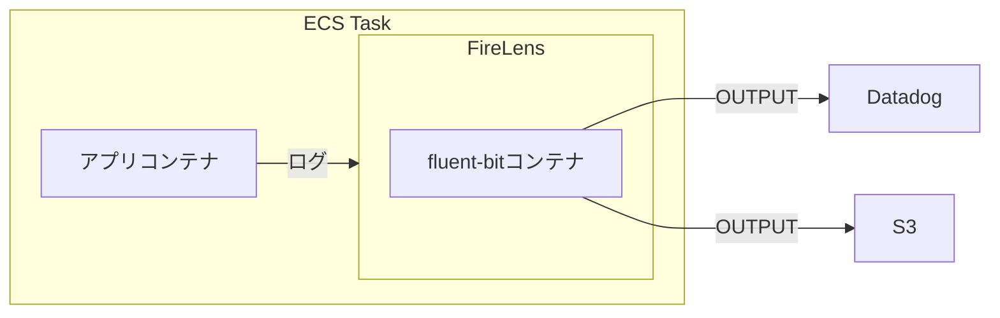

aws-cdkを使って助かることは、作成したいAWSサービスとその設定を一度コードにすれば動的に管理できること。
複雑な設定やサボりがちな考慮をまとめてコードにすれば、自身の知識を共有しやすい。

と再認識したのでFireLensをECS Fargateに設定する際のTipsを記載する。

## FireLens for Amazon ECS

AWSやDatadogのドキュメントを読んでも何をどのように設定すれば良いのか分かりずらく...
そのため任意のタスク定義にFireLens設定を追加するコンストラクタを作成した。

https://docs.aws.amazon.com/AmazonECS/latest/developerguide/firelens-taskdef.html

ECSタスク定義はすでに存在している前提として、

1. firelensコンテナ(fluent-bit)の作成
- S3バケットとDatadog、両方に同じログを送信する方針とする
- fluent-bitコンフィグを含むコンテナをビルドしてECRにプッシュしておく

2. firelensを既存のタスク定義に追加する
  - コンテナ環境変数には`DD_*`を設定してfluent-bitコンフィグの変数として扱う

3. firelensに必要なIAM権限を定義する

をひとまとめにしている。
インターフェイス例は次のとおり。

```ts
export function addFirelensLogRouter(
  scope: Construct,
  appContext: appContext,
  projectName: string,
  serviceName: string,
  taskDef: ecs.TaskDefinition,
  datadogApiKey: ecs.Secret,
): void {}
```

FireLensの追加は[ecs.FirelensLogRouter](https://docs.aws.amazon.com/cdk/api/v2/docs/aws-cdk-lib.aws_ecs.FirelensLogRouter.html)で可能だったが、それを見つけることにも時間は溶けた気がする...

```ts
  new ecs.FirelensLogRouter(scope, `${serviceName}-LogRouter`, {
    // 中略
    firelensConfig: {
      type: ecs.FirelensLogRouterType.FLUENTBIT,
      options: {
        configFileType: ecs.FirelensConfigFileType.FILE,
        configFileValue: fireLensSettings.configFilePath, //コンテナにコミットしたコンフィグの絶対パス
        enableECSLogMetadata: true,
      },
    },
    environment: {
      DD_SERVICE: serviceName,
      DD_SOURCE: projectName,
      DD_TAGS: `env:${profileName}`,
      FIRELENS_BUCKETNAME: logBucketName,
    },
    secrets: {
      DD_API_KEY: datadogApiKey,
    },
  });
```

FireLens設定を追加したタスク定義と一緒にあるアプリコンテナ側では、ログドライバ設定は次のようになる。
[DatadogのFireLensドキュメント](https://docs.datadoghq.com/ja/integrations/ecs_fargate/?tab=awscli)では、アプリコンテナ側に色々と`options: {}`を設定しているが、fluent-bitのコンフィグで同等の設定をしていれば不要だった。
```ts
  logging: ecs.LogDrivers.firelens({
  }),  
```

fluent-bitコンフィグに関しては、[Fluent Bit: Official Manual](https://docs.fluentbit.io/manual/pipeline/outputs/datadog)を参考にして割とそのまま使えた。(ログ送信できるようになってからの`FILTER`などは割愛)

(コンテナの環境変数を使っている部分だけ、fluent-bitコンフィグを抜粋)
```
[OUTPUT]
    Name datadog
    Match *
    TLS on
    compress gzip
    provider ecs
    apikey ${DD_API_KEY}
    dd_service ${DD_SERVICE}
    dd_source ${DD_SOURCE}
    dd_tags ${DD_TAGS}

[OUTPUT]
    Name s3
    Match *
    bucket ${FIRELENS_BUCKETNAME}
    region ap-northeast-1
    total_file_size 1M
    upload_timeout 1m
    use_put_object Off
    compression gzip
    content_type application/gzip
    static_file_path On
    s3_key_format_tag_delimiters -
    s3_key_format /firelens/${DD_SOURCE}/$TAG[0]/%Y/%m/%d/%H-%M-%S.gz
```

## FireLensとFluentBitの関係
ECSタスクとFireLensは`1:1`対応で、ログ送信元のコンテナは複数あっても問題なく機能します。

AWSブログの[詳解 FireLens](https://aws.amazon.com/jp/blogs/news/under-the-hood-firelens-for-amazon-ecs-tasks/)に詳しいですが、模式図としては次の通りです。



これでモニタリング目的のログはDatadogで管理し、ログ分析などの長期保存はS3で管理、という使い分けを同じログを使って行うことができる。
