## はじめに

先日、職場で`terraform apply`前のplanで意図しない変更に気付けず、ヒヤッとする場面があった。

Terraformで管理しているインフラに、手動変更やAPI経由の変更が混ざって「コードと実態が乖離する」──いわゆる**ドリフト**は、一つの仕組みで完全に防ぐことは難しい。と再認識したので、まずは「plan差分を検知したら、その内容をGitHub Issueを自動作成する」というGitHub Actionsを作成した。

今回、まだ初期構築の段階なので「`terraform plan`の出力がGitHubにおけるコミット差分と一致しているかどうか」は評価していない。

意図した通りの差分であればドリフトではないので、plan内容とコミット差分の一致は生成AIに丸投げしてまとめてもらおう、と考えている。

### この記事で扱う構成

```sh
.github/
└── workflows
    └── terraform-plan.yaml
terraform/aws/
├── main.tf
├── terraform.tf
├── providers.tf
├── variables.tf
├── locals.tf
├── outputs.tf
├── envs/
│   ├── develop/
│   │   ├── backend.hcl
│   │   └── terraform.tfvars
│   └── production/
│       ## 中略
└── modules/
    └── github-oidc/
        ├── main.tf
        ├── variables.tf
        └── outputs.tf
## 以下略
```

## terraform-plan.yaml概要

ドリフト検知の仕組みは、大きく3つのパートで構成される。

1. **GitHub Actions → AWS のOIDC認証**: シークレットなしでAWSリソースにアクセスする
2. **`terraform plan -detailed-exitcode`**: 差分の有無を終了コードで判定する
3. **`gh issue create`によるIssue自動作成**: ドリフト検知時のみ、Planの内容をIssueに起票する

```mermaid
flowchart LR
    A[GitHub Actions<br/>schedule / dispatch] --> B[OIDC認証<br/>AWS STS]
    B --> C[terraform plan<br/>-detailed-exitcode]
    C -->|exit 0: 差分なし| D[正常終了]
    C -->|exit 2: 差分あり| E[GitHub Issue<br/>自動作成]
    C -->|exit 1: エラー| F[ワークフロー失敗]
```



## Step 1: GitHub Actions → AWS のOIDC認証を構築する

### なぜOIDCか

GitHub ActionsからAWSを操作する方法として、IAMユーザーのアクセスキーをSecretsに保存する手段がある。しかし、長期クレデンシャルは漏洩リスクやローテーション運用の負荷が課題になる。

OIDC（OpenID Connect）を使えば、GitHub Actionsのワークフロー実行時にAWS STSから一時的なクレデンシャルを取得できる。シークレットの管理が不要になり、セキュリティと運用の両面で優位。

### Terraformモジュールの実装

OIDC認証に必要なAWSリソースをTerraformモジュールとして実装する。

```hcl:modules/github-oidc/variables.tf
variable "github_repositories" {
  description = "List of GitHub repositories allowed to assume the role (e.g. [\"owner/repo\"])"
  type        = list(string)

  validation {
    condition     = alltrue([for r in var.github_repositories : can(regex("^[^/]+/[^/]+$", r))])
    error_message = "Each repository must be in the format 'owner/repo'."
  }
}

variable "iam_role_name" {
  description = "Name of the IAM role for GitHub Actions"
  type        = string
}

variable "iam_policy_arns" {
  description = "List of IAM policy ARNs to attach to the role"
  type        = list(string)
  default     = []
}

variable "allowed_branches" {
  description = "List of branch refs to allow (e.g. [\"refs/heads/main\"]). If empty, all refs are allowed."
  type        = list(string)
  default     = []
}

variable "max_session_duration" {
  description = "Maximum session duration in seconds for the IAM role"
  type        = number
  default     = 3600
}
```

```hcl:modules/github-oidc/main.tf
locals {
  github_oidc_url = "https://token.actions.githubusercontent.com"
  audience        = "sts.amazonaws.com"

  sub_conditions = length(var.allowed_branches) > 0 ? flatten([
    for repo in var.github_repositories : [
      for branch in var.allowed_branches : "repo:${repo}:ref:${branch}"
    ]
  ]) : [for repo in var.github_repositories : "repo:${repo}:*"]
}

# OIDC Identity Provider
resource "aws_iam_openid_connect_provider" "github" {
  url             = local.github_oidc_url
  client_id_list  = [local.audience]
  thumbprint_list = ["ffffffffffffffffffffffffffffffffffffffff"]
}

# IAM Role with trust policy
data "aws_iam_policy_document" "assume_role" {
  statement {
    effect  = "Allow"
    actions = ["sts:AssumeRoleWithWebIdentity"]

    principals {
      type        = "Federated"
      identifiers = [aws_iam_openid_connect_provider.github.arn]
    }

    condition {
      test     = "StringEquals"
      variable = "token.actions.githubusercontent.com:aud"
      values   = [local.audience]
    }

    condition {
      test     = "StringLike"
      variable = "token.actions.githubusercontent.com:sub"
      values   = local.sub_conditions
    }
  }
}

resource "aws_iam_role" "github_actions" {
  name                 = var.iam_role_name
  assume_role_policy   = data.aws_iam_policy_document.assume_role.json
  max_session_duration = var.max_session_duration
}

resource "aws_iam_role_policy_attachment" "this" {
  count      = length(var.iam_policy_arns)
  role       = aws_iam_role.github_actions.name
  policy_arn = var.iam_policy_arns[count.index]
}
```

### ポイント: ブランチ制限の設計

`sub_conditions`のロジックで、OIDCトークンの`sub`クレームに対してブランチレベルの制限をかけている。

- `allowed_branches`を指定した場合 → `repo:owner/repo:ref:refs/heads/main` のように特定ブランチのみ許可
- 未指定の場合 → `repo:owner/repo:*` でワイルドカード許可

本番環境では`refs/heads/main`のみに絞り、開発環境では柔軟にする、といった使い分けが可能。

### 環境ごとの設定を`locals`で管理

```hcl:locals.tf
locals {
  system = var.system
  env    = var.env

  env_config = {
    develop = {
      github_repositories = ["terusaku/etc"]
      iam_policy_arns     = [
        "arn:aws:iam::aws:policy/PowerUserAccess",
        "arn:aws:iam::aws:policy/IAMReadOnlyAccess",
      ]
      allowed_branches    = ["refs/heads/main"]
    }
    production = {
      github_repositories = ["terusaku/etc"]
      iam_policy_arns     = []
      allowed_branches    = ["refs/heads/main"]
    }
  }

  naming = {
    prefix              = "${local.system}-${local.env}"
    github_actions_role = "${local.system}-${local.env}-github-actions-oidc"
  }
}
```

`env_config`マップで環境差分を一元管理し、モジュール呼び出し側では`local.env_config[local.env]`で参照するだけにしている。環境が増えてもマップにエントリを追加するだけで対応できる。

### バックエンドの環境分離

```hcl:envs/develop/backend.hcl
bucket       = "aws-terraform-tfstate-176272758206"
key          = "etc_develop/terraform.tfstate"
region       = "ap-northeast-1"
encrypt      = true
use_lockfile = true
```

`terraform init -backend-config=envs/<env>/backend.hcl` で環境ごとにstateファイルを分離する。同一のTerraformコードを複数環境に適用する定番パターン。

## Step 2: GitHub Actionsワークフローの実装

### `terraform plan -detailed-exitcode` の仕組み

`terraform plan`に`-detailed-exitcode`フラグを付与すると、終了コードが3段階に変わる。

| 終了コード | 意味 |
|:---:|:---|
| 0 | 差分なし（インフラとコードが一致） |
| 1 | エラー発生 |
| 2 | 差分あり（ドリフト検知） |

この終了コードを後続ステップの条件分岐に使うのがドリフト検知の核心。

### ワークフロー全体

```yaml:.github/workflows/terraform-plan.yaml
name: Terraform Plan & Drift Detection

on:
  workflow_dispatch:
    inputs:
      environment:
        required: true
        description: '実行対象の環境名'

  # schedule:
  #   - cron: '0 0 * * 1'  # 毎週月曜 09:00 JST

concurrency:
  group: terraform-plan-${{ github.head_ref }}
  cancel-in-progress: true

permissions:
  contents: read
  pull-requests: write
  issues: write
  id-token: write  # OIDC認証に必須

env:
  TF_VERSION: '1.14.4'
  TF_WORKING_DIR: 'terraform/aws'
```

**permissionsの設計**が重要。`id-token: write`はOIDC認証のトークン取得に必要で、`issues: write`はIssue自動作成に必要。最小権限の原則に沿って必要なものだけを明示している。

### Plan実行ステップ

```yaml
steps:
  - name: Checkout
    uses: actions/checkout@v6

  - name: Configure AWS Credentials (OIDC)
    uses: aws-actions/configure-aws-credentials@v4
    with:
      role-to-assume: ${{ vars.IAM_ASSUMED_ROLE_ARN }}
      aws-region: ap-northeast-1
      role-session-name: GitHubActions-etc-${{ github.run_id }}

  - name: Setup Terraform
    uses: hashicorp/setup-terraform@v3
    with:
      terraform_version: ${{ env.TF_VERSION }}
      terraform_wrapper: false  # JSON出力のためラッパーを無効化

  - name: Terraform Init & Validate
    id: init
    working-directory: ${{ env.TF_WORKING_DIR }}
    run: |
      terraform init -backend-config=envs/${{ inputs.environment }}/backend.hcl -no-color
      terraform validate -no-color

  - name: Terraform Plan
    id: plan
    working-directory: ${{ env.TF_WORKING_DIR }}
    run: |
      set +e
      terraform plan \
        -var env=${{ inputs.environment }} \
        -no-color \
        -detailed-exitcode \
        -out=tfplan.binary > plan.txt 2>&1
      EXIT_CODE=$?
      echo ${EXIT_CODE}

      set -e
      cat plan.txt
      echo "exitcode=${EXIT_CODE}" >> $GITHUB_OUTPUT
      if [ "${EXIT_CODE}" -eq 1 ]; then exit 1; fi
```

#### `set +e` / `set -e` の切り替えが肝

`-detailed-exitcode`は差分がある場合に終了コード`2`を返す。しかしGitHub Actionsはデフォルトで非ゼロの終了コードをエラーとして扱い、ステップが失敗する。

そのため：
1. `set +e` でエラー時の即時終了を無効化
2. `terraform plan`を実行して終了コードを変数に保存
3. `set -e` でエラーハンドリングを戻す
4. 終了コード`1`（本当のエラー）の場合のみ`exit 1`で失敗させる

`terraform_wrapper: false`は`hashicorp/setup-terraform`のラッパースクリプトを無効にする設定。ラッパーが有効だと終了コードが正しく取得できないため、`-detailed-exitcode`を使う場合は必須。

## Step 3: ドリフト検知時のIssue自動作成

### 実装

```yaml
- name: Create issue when drift
  id: drift
  if: steps.plan.outputs.exitcode == '2'
  working-directory: ${{ env.TF_WORKING_DIR }}
  env:
    GH_TOKEN: ${{ github.token }}
  run: |
    STATE_SERIAL=$(terraform state pull | jq -r '.serial')
    TITLE="[${{ inputs.environment }}] Terraform Drift Detected (tf-state-serial@${STATE_SERIAL})"

    # 同一タイトルの open issue が存在する場合はスキップ
    if gh issue list --state open --label "terraform-drift" --limit 100 --json title \
      | jq -e --arg t "${TITLE}" '[.[] | select(.title == $t)] | length > 0' > /dev/null 2>&1; then
      echo "Issue already exists: ${TITLE} — skipping"
      exit 0
    fi

    cat <<EOF > issue_body.md
    ## Terraform Plan Summary

    **Environment:** \`${{ inputs.environment }}\`
    **Commit Hash:** ${{ github.server_url }}/${{ github.repository }}/commit/${{ github.sha }}
    **Triggered by:** @${{ github.actor }}
    **Workflow Run:** ${{ github.server_url }}/${{ github.repository }}/actions/runs/${{ github.run_id }}

    ### Plan Output
    \`\`\`
    $(terraform show tfplan.binary)
    \`\`\`
    EOF

    gh issue create \
      --title "${TITLE}" \
      --body-file issue_body.md \
      --label "terraform-drift"
```

### 設計上の工夫

#### 1. State Serialをタイトルに含めて重複を防ぐ

`terraform state pull`でstateファイルの`serial`（更新ごとにインクリメントされる通し番号）を取得し、Issueタイトルに埋め込んでいる。

```
[develop] Terraform Drift Detected (tf-state-serial@42)
```

これにより：
- 同じドリフトが継続している間は同一タイトルになるため、重複Issueが作られない
- `terraform apply`でstateが更新されると`serial`が変わるため、新たなドリフトは別Issueとして起票される

#### 2. 既存Issue検索による冪等性の担保

```bash
gh issue list --state open --label "terraform-drift" --limit 100 --json title \
  | jq -e --arg t "${TITLE}" '[.[] | select(.title == $t)] | length > 0'
```

`gh issue list`でオープン状態の`terraform-drift`ラベル付きIssueを取得し、同一タイトルが存在すればスキップする。スケジュール実行で毎週走っても、同じドリフトに対して何度もIssueが作られることはない。

#### 3. Plan出力をIssue本文に含める

`terraform show tfplan.binary`でバイナリプランファイルを人間が読める形式に変換し、Issue本文に埋め込んでいる。`-out=tfplan.binary`で保存したバイナリプランをそのまま活用する。

これにより、Issueを見るだけで「何が変わっているか」を把握でき、ワークフローのログを辿る手間が省ける。

## 運用に向けて

### スケジュール実行の追加

現在は`workflow_dispatch`（手動実行）だが、本番運用では`schedule`トリガーを追加して定期実行する。

```yaml
on:
  schedule:
    - cron: '0 0 * * 1'  # 毎週月曜 00:00 UTC (09:00 JST)
  workflow_dispatch:
    inputs:
      environment:
        required: true
        description: '実行対象の環境名'
```

頻度はチームの運用に合わせて調整する。ドリフトの発生頻度が高い初期は毎日、安定してきたら週次にするなど段階的に緩めていくのが現実的。

### PR連動のPlan実行（将来拡張）

ドリフト検知とは別に、PRトリガーでPlan結果をPRコメントに投稿する拡張も考えられる。ワークフローの`on`トリガーと`detect-changes`ジョブを有効にし、matrixストラテジーで変更のあったディレクトリだけを対象にすれば効率的に回せる。

## まとめ

| 項目 | 採用した手段 |
|:---|:---|
| AWS認証 | GitHub Actions OIDC（長期クレデンシャル不要） |
| ドリフト検知 | `terraform plan -detailed-exitcode`（exit code 2） |
| 通知 | `gh issue create`でGitHub Issue自動作成 |
| 冪等性 | State Serial + 既存Issue検索で重複防止 |
| 環境分離 | `backend.hcl` + `terraform.tfvars` + `locals`マップ |

ドリフト検知の仕組み自体はシンプルだが、**OIDC認証の構築**、**終了コードのハンドリング**、**Issue重複防止のロジック**など、実際に動かすまでに細かいハマりどころがある。

特に`terraform_wrapper: false`を忘れて終了コードが取れない問題や、`set +e`の切り替えタイミングは、ドキュメントだけでは気づきにくいポイントだった。

この仕組みをベースに、Slack通知の追加やPR連動のPlan実行など、チームの運用フローに合わせて拡張していく予定。
