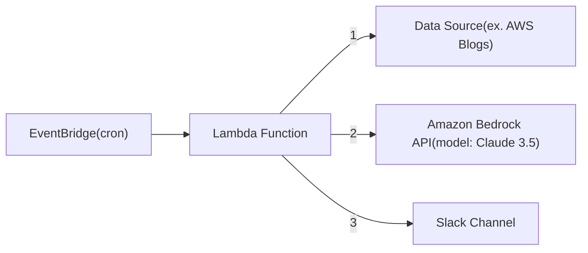

公私ともにクラウドサービスを使う日々なので、「信頼する情報源からニュースや更新情報（リリース、アップデート）を取得したい」ということで BedrockとClaude 3.5 Sonnetを使った自動要約をつくりました。
現状、レイテンシやAPIレートリミットが面倒なので... Claude 3.7では無いです。

## はじめに
個人的には「信頼する情報源」という重要性がLLMの登場によって（残念ながら）増してきているので、英語のWebサイトを読むことは増えました。
キャッチアップするにも都度翻訳しつつ労力が発生しているので、次のようにシステムプロンプトを決めてClaudeのAPIを定期実行する仕組みにしました。

```text
"This is html from Tech Blog. Retrieve last 1 weeks infomation, summarize and translate in Japanese."
"The summary must focus on what is uniqueness and innovation, which attract web developers or product managers. If original infomation contain hyperlinks, answer with the url.",
```



::::details AWS Blogの通知例
:::message
2025/03/29 21時頃の実行された場合

:::
::::


## Bedrock APIの実装Tips
今回、cross-region inferenceを有効化して使っています。
https://docs.aws.amazon.com/bedrock/latest/userguide/cross-region-inference.html
> Cross-region inference requests are kept within the AWS Regions that are part of the geography where the data originally resides.
> For example, a request made within the US is kept within the AWS Regions in the US.
> Although the data remains stored only in the source region, your input prompts and output results might move outside of your source region during cross-region inference. All data will be transmitted encrypted across Amazon’s secure network.

データはリージョン内に保存しつつ、通信はクロスリージョンになることを許容するとAPIのスループットが緩和される、というAWSサービス仕様です。

Azure OpenAI Serviceでも同様の仕組みがあるので、現代のLLMにおけるハードリミットと言えそうです。
https://learn.microsoft.com/en-us/azure/ai-services/openai/how-to/deployment-types#global-standard
> ### Global standard
> Global deployments are available in the same Azure OpenAI resources as non-global deployment types but allow you to leverage Azure's global infrastructure to dynamically route traffic to the data center with best availability for each request. Global provisioned deployments provide reserved model processing capacity for high and predictable throughput using Azure global infrastructure.


## 実装コード抜粋：Bedrock API呼び出し

```python
def genAI_invokeModel(
    model_id: str,
    system_prompt: str,
    user_msg: str,
    temperature: float = 0.7,
    top_k: int = 200,
) -> Dict[str, Any]:
    bedrock_client = boto3.client("bedrock-runtime")

    # リクエスト本体
    messages = {
        "role": "user",
        "content": [
            {
                "type": "text",
                "text": user_msg,
            }
        ],
    }

    request_body = {
        "anthropic_version": "bedrock-2023-05-31",
        "temperature": temperature,
        "top_k": top_k,
        "max_tokens": 10000,
        "system": system_prompt,
        "messages": [
            messages,
        ],
    }

    try:
        # モデル呼び出し
        response = bedrock_client.invoke_model(
            modelId=model_id, body=json.dumps(request_body)
        )

        # レスポンス解析
        response_body = json.loads(response["body"].read())

        # トークン使用量のログ記録
        if "usage" in response_body:
            usage = response_body["usage"]
            logger.info(f"Input Tokens: {usage.get('input_tokens', 'N/A')}")
            logger.info(f"Output Tokens: {usage.get('output_tokens', 'N/A')}")

        return response_body

    except Exception as e:
        logger.error(f"Failed to call Bedrock API: {e}")
        raise
```

追加するチャンク数のチューニングをClaude 3.7に聞いたら、次のように提案されました。
実際には処理をループ実行してサンプル結果を評価した方が良いですが、事例としては分かりやすい。
```python
def select_top_k_by_task(task_type: str) -> int:
    """
    タスクタイプに基づいてtop_kの値を選択
    """
    task_mapping = {
        "creative_writing": 400,  # 創造的なコンテンツ生成
        "factual_qa": 100,        # 事実ベースの質問応答
        "code_generation": 150,   # コード生成
        "summarization": 200,     # 要約
        "translation": 80,        # 翻訳
        "classification": 50,     # 分類タスク
    }
    
    return task_mapping.get(task_type, 200)  # デフォルト値200
```


## 今後の改善メモ

### マルチモーダル対応？

現状はテキストのみ処理していますが、個人的には動画にも対応できたらキャッチアップの幅が広がって良さそう、という考えです。
LLMに動画を渡してもそのまま処理できる訳はないので、AWSで言う[Rekognition Video](https://aws.amazon.com/rekognition/video-features/)のような機能と組み合わせないと無理、というところです。

動画の音声をテキスト化するAWSサービスは[Transcribe](https://aws.amazon.com/transcribe/)なので、何らかの講演をキャッチアップしたい場合はこちらが適しているかもしれない。

この辺りまで来ると、コンテンツの著作権も気になってくるのでそのうち試してみます。
