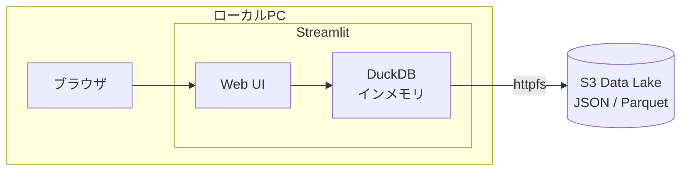

SREチームでは「あの時何が起きていたか」をログから素早く特定する場面が日常的にある。Datadogなどの監視SaaSでアラートは拾えるが、Auth0やアプリケーション固有のログを横断検索したいとき、S3に蓄積されたJSONログを直接SQLで叩けると便利だ。

そこで **DuckDB + Streamlit** で、ブラウザからS3上のログをSQL検索できる簡易ツールを作った話を書く。

## 背景：S3ログ検索の選択肢

S3に保存されたログを検索する方法はいくつかある。

| 手法 | 特徴 | 課題 |
|------|------|------|
| **Athena** | サーバーレスでスケーラブル | クエリ課金、テーブル定義の管理が必要 |
| **CloudWatch Logs Insights** | AWSネイティブ | S3直接参照不可、独自クエリ構文 |
| **ローカルでjq** | 手軽 | 大量ファイルの結合・集計が辛い |
| **DuckDB** | インメモリSQL、S3直接参照 | ローカル実行のためスケールは限定的 |

SREの現場で欲しいのは「Athenaほど大げさでなく、jqよりも柔軟にSQLで集計できるもの」だった。DuckDBはまさにそのスイートスポットにいる。

## DuckDBの何が嬉しいか

### S3上のJSONを直接SQLで読める

テーブル定義不要。`read_json()` 関数にS3パスを渡すだけでクエリできる。

```sql
SELECT detail.data.user_name, COUNT(*) AS cnt
FROM read_json('s3://my-bucket/logs/year=2026/month=02/day=*/events-*.json',
               hive_partitioning = true)
GROUP BY detail.data.user_name
ORDER BY cnt DESC
LIMIT 20;
```

ポイントは以下の3つ。

- **Hiveパーティション対応**: `year=YYYY/month=MM/day=DD` のディレクトリ構造をそのまま認識し、パーティションプルーニングが効く
- **ネストしたJSONの直接参照**: `detail.data.user_name` のようにドット記法でネスト構造を辿れる
- **ワイルドカード**: `day=*` で月全体、ファイル名の `*.json` で複数ファイルを一括読み込み

### httpfs拡張でS3透過アクセス

DuckDBの `httpfs` と `aws` 拡張を組み合わせると、ローカルの AWS 認証情報をそのまま使ってS3にアクセスできる。

```python
conn = duckdb.connect()
conn.execute("INSTALL httpfs; LOAD httpfs;")
conn.execute("INSTALL aws; LOAD aws;")
conn.execute("CALL load_aws_credentials();")
```

`aws-sso login` 済みの環境ならこれだけで動く。IAMユーザーの場合も環境変数の `AWS_ACCESS_KEY_ID` 等を自動で読み取る。

### インメモリで高速

1日分のAuth0ログ（数万件のNDJSON）なら数秒で返ってくる。月全体を走査しても2分程度。Athenaのようなクエリキューの待ち時間がないので、試行錯誤しながらの調査に向いている。

## アーキテクチャ



構成はシンプルで、Streamlitがブラウザ向けのUIとDuckDBのクエリエンジンを1プロセスで提供する。外部サービスへの依存はS3のみ。

## 実装のポイント

### 依存関係は最小限

```toml
[project]
name = "duckdb-s3-explorer"
requires-python = ">=3.13"
dependencies = [
    "streamlit>=1.31.0",
    "duckdb>=1.1.0",
    "pandas>=2.2.0",
]
```

3つのライブラリだけ。パッケージマネージャは `uv` を使っているので `uv run streamlit run app.py` 一発で起動できる。

### DuckDB接続のキャッシュ

Streamlitはユーザー操作のたびにスクリプト全体を再実行する仕様のため、DuckDB接続を毎回作り直すと非効率。`@st.cache_resource` でプロセスレベルにキャッシュしている。

```python
@st.cache_resource
def get_connection():
    conn = duckdb.connect()
    conn.execute("INSTALL httpfs; LOAD httpfs;")
    conn.execute("INSTALL aws; LOAD aws;")
    conn.execute("CALL load_aws_credentials();")
    return conn
```

### 動的なWHERE句の組み立て

サイドバーの各フィルタ入力から、WHERE句を動的に組み立てている。

```python
where_parts = []
if keyword:
    kw = keyword.replace("'", "''")
    where_parts.append(
        f"(detail.data.user_name ILIKE '%{kw}%' "
        f"OR detail.data.client_name ILIKE '%{kw}%' ...)"
    )
if event_type:
    where_parts.append(f"detail.data.type = '{event_type}'")
# ... 他のフィルタも同様

where_sql = f"WHERE {' AND '.join(where_parts)}" if where_parts else ""
```

DuckDBの `ILIKE` による大文字小文字を無視した部分一致検索が、ログ調査では特に重宝する。

### サンプルクエリのプリセット

SREメンバーがSQLに不慣れでもすぐ使えるよう、よく使うクエリをワンクリックで実行できるボタンを用意した。

- **件数カウント**: 指定期間のログ総数
- **イベント種別ごとの件数**: 認証成功/失敗の分布
- **ユーザーごとの件数**: 特定ユーザーの行動追跡
- **カラム確認**: `DESCRIBE` でスキーマを確認

## SREとしての使いどころ

### インシデント調査
「特定ユーザーが〇〇時頃からログインできない」という問い合わせに対して、ユーザー名とイベントタイプでフィルタをかけ、失敗イベントの時系列を即座に確認できる。

### 傾向分析
イベント種別ごとの件数をGROUP BYで集計して、認証失敗率の推移を確認する。Datadogのダッシュボードでは見えにくい「Auth0固有のイベントタイプ」レベルの分析ができる。

### アドホックな調査
「このIPアドレスから大量のリクエストが来ていないか」「特定のclient_nameの利用状況は」など、事前にダッシュボードを用意していない切り口での調査に対応できる。

## ローカルでの動作確認

S3にアクセスできない環境でも、サンプルデータ生成スクリプトでローカルテストができる。

```bash
uv run python generate_sample_data.py
```

`sample_data/year=YYYY/month=MM/day=DD/` にHiveパーティション形式のNDJSONが生成されるので、S3パスを `sample_data/` に書き換えればローカルで同じSQLが動く。

## Athenaとの使い分け

最後に、DuckDBローカル実行とAthenaの使い分けについて。

| 観点 | DuckDB（今回のツール） | Athena |
|------|----------------------|--------|
| **用途** | アドホック調査、インシデント対応 | 定期レポート、大規模集計 |
| **データ量** | GB単位まで実用的 | TB単位でもOK |
| **コスト** | 無料（ローカル実行） | スキャン量課金 |
| **準備** | テーブル定義不要 | Glueカタログ or CREATE TABLE |
| **認証** | ローカルのAWS認証情報 | IAMポリシー |

SREの現場では両方を使い分けている。日常の調査は今回のDuckDBツールで素早く対応し、月次レポートや長期間の分析はAthenaに任せる、という棲み分けが心地よい。

## まとめ

- DuckDBの `read_json()` + `httpfs` でS3ログをテーブル定義なしにSQL検索できる
- Streamlitと組み合わせると、170行程度のPythonでブラウザベースのログ検索UIが作れる
- SREのインシデント調査やアドホック分析において、Athenaを立ち上げるまでもない場面で重宝している

「ちょっとログを確認したい」を最短距離で実現するツールとして、DuckDB + Streamlitの組み合わせはおすすめ。

## リファレンス

https://duckdb.org/docs/extensions/httpfs/s3api.html
https://duckdb.org/docs/data/json/overview
https://docs.streamlit.io/develop/api-reference/caching-and-state/st.cache_resource
