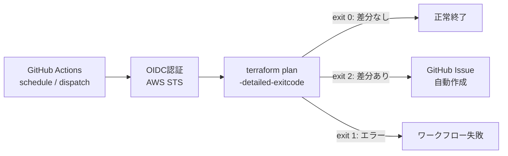

## はじめに

先日、職場で`terraform apply`前のplanで意図しない変更に気付けず、ヒヤッとする場面があった。

Terraformで管理しているインフラに、手動変更やAPI経由の変更が混ざって「コードと実態が乖離する」──いわゆる**ドリフト**は、一つの仕組みで完全に防ぐことは難しい。と再認識したので、まずは「plan差分を検知したら、その内容をGitHub Issueを自動作成する」というGitHub Actionsを作成した。

今回、まだ初期構築の段階なので「`terraform plan`の出力がGitHubにおけるコミット差分と一致しているかどうか」は評価していない。

意図した通りの差分であればドリフトではないので、plan内容とコミット差分の一致は生成AIに丸投げしてまとめてもらおう、と考えている。

### この記事で扱う構成

```sh
.github/
└── workflows
    └── terraform-plan.yaml
terraform/aws/
├── main.tf
├── terraform.tf
├── providers.tf
├── variables.tf
├── locals.tf
├── outputs.tf
├── envs/
│   ├── develop/
│   │   ├── backend.hcl
│   │   └── terraform.tfvars
│   └── production/
│       ## 中略
└── modules/
    └── github-oidc/
        ├── main.tf
        ├── variables.tf
        └── outputs.tf
## 以下略
```

## terraform-plan.yaml概要

ドリフト検知の流れとしては次の通り。

1. **GitHub Actions → AWS のOIDC認証**: シークレットなしでAWSリソースにアクセスする
2. **`terraform plan -detailed-exitcode`**: 差分の有無を終了コードで判定する
3. **`gh issue create`によるIssue自動作成**: ~~ドリフト検知時のみ~~ (今回は差分があれば)Plan結果をIssueとして作成する



## Step 1: GitHub Actions → AWS のOIDC認証
作成リソースの詳細はGitHub提供のドキュメント通りなので、割愛する...
https://docs.github.com/en/actions/how-tos/secure-your-work/security-harden-deployments/oidc-in-aws

OIDC（OpenID Connect）を使えば、GitHub ActionsはIAMロールArnを知っているだけで、一時的なクレデンシャルを取得できる。シークレットの管理が不要になり、セキュリティと運用の両面で優位。

今回のサンプルとして、そのIAMロールをterraformで作成している。

### Terraformモジュールの実装

OIDC認証に必要なAWSリソースをTerraformモジュールとして実装する。


::::details terraformサンプル: github-oidcモジュール
:::message
```hcl:modules/github-oidc/variables.tf
variable "github_repositories" {
  description = "List of GitHub repositories allowed to assume the role"
  type        = list(string)
}

variable "iam_role_name" {
  description = "Name of the IAM role for GitHub Actions"
  type        = string
}

variable "iam_policy_arns" {
  description = "List of IAM policy ARNs to attach to the role"
  type        = list(string)
  default     = []
}

variable "allowed_branches" {
  description = "List of branch refs to allow (e.g. [\"refs/heads/main\"]). If empty, all refs are allowed."
  type        = list(string)
  default     = []
}

variable "max_session_duration" {
  description = "session duration in seconds for Assumed Role"
  type        = number
  default     = 600
}
```

```hcl:modules/github-oidc/main.tf
locals {
  github_oidc_url = "https://token.actions.githubusercontent.com"
  audience        = "sts.amazonaws.com"

  sub_conditions = length(var.allowed_branches) > 0 ? flatten([
    for repo in var.github_repositories : [
      for branch in var.allowed_branches : "repo:${repo}:ref:${branch}"
    ]
  ]) : [for repo in var.github_repositories : "repo:${repo}:*"]
}

# OIDC Identity Provider
resource "aws_iam_openid_connect_provider" "github" {
  url             = local.github_oidc_url
  client_id_list  = [local.audience]
  thumbprint_list = ["16進数フォーマットならどんな文字列でもOK"]  
}

# IAM Role with trust policy
data "aws_iam_policy_document" "assume_role" {
  statement {
    effect  = "Allow"
    actions = ["sts:AssumeRoleWithWebIdentity"]

    principals {
      type        = "Federated"
      identifiers = [aws_iam_openid_connect_provider.github.arn]
    }

    condition {
      test     = "StringEquals"
      variable = "token.actions.githubusercontent.com:aud"
      values   = [local.audience]
    }

    condition {
      test     = "StringLike"
      variable = "token.actions.githubusercontent.com:sub"
      values   = local.sub_conditions
    }
  }
}

resource "aws_iam_role" "github_actions" {
  name                 = var.iam_role_name
  assume_role_policy   = data.aws_iam_policy_document.assume_role.json
  max_session_duration = var.max_session_duration
}

resource "aws_iam_role_policy_attachment" "this" {
  count      = length(var.iam_policy_arns)
  role       = aws_iam_role.github_actions.name
  policy_arn = var.iam_policy_arns[count.index]
}
```
:::
::::

### ポイント: ブランチ制限の設計

`sub_conditions`のロジックで、OIDCトークンの`sub`クレームに対してブランチレベルの制限をかけている。

- `allowed_branches`を指定した場合 → `repo:owner/repo:ref:refs/heads/main` のように特定ブランチのみ許可
- 未指定の場合 → `repo:owner/repo:*` でブランチ制限なしにOIDC認証は許可される

本番環境では`refs/heads/main`のみ、ステージングでは`refs/heads/staging`に絞り、開発環境では柔軟にする、といった制限も可能。

### 環境ごとの設定を`locals`で管理
`env_config`マップで環境差分を一元管理し、モジュール呼び出し側では`local.env_config[local.env]`で参照するだけにしている。環境が増えてもマップにエントリを追加するだけで対応できる。

::::details terraformサンプル: locals抜粋
:::message
```hcl:locals.tf
locals {
  system = var.system
  env    = var.env

  env_config = {
    develop = {
      github_repositories = [""]
      iam_policy_arns     = [
        ""
      ]
      allowed_branches    = [""]
    }
    production = {
      github_repositories = [""]
      iam_policy_arns     = []
      allowed_branches    = ["refs/heads/main"]
    }
  }

  naming = {
    prefix              = "${local.system}-${local.env}"
    github_actions_role = "${local.system}-${local.env}-github-actions-oidc"
  }
}
```
:::
::::

## Step 2: GitHub Actionsワークフローの実装

### `terraform plan -detailed-exitcode` の仕組み

`terraform plan`に`-detailed-exitcode`フラグを付与すると、終了コードが3段階に変わる。

| 終了コード | 意味 |
|:---:|:---|
| 0 | 差分なし（インフラとコードが一致） |
| 1 | エラー発生 |
| 2 | 差分あり（ドリフト検知） |

この終了コードを後続ステップの条件分岐に使うのがドリフト検知の核心。

`-detailed-exitcode`は差分がある場合に終了コード`2`を返す。しかしGitHub Actionsはデフォルトで非ゼロの終了コードをエラーとして扱い、ステップが失敗する。

そのため：
1. `set +e` でエラー時の即時終了を無効化
2. `terraform plan`を実行して終了コードを変数に保存
3. `set -e` でエラーハンドリングを戻す
4. 終了コード`1`（本当のエラー）の場合のみ`exit 1`で失敗させる

`terraform_wrapper: false`は`hashicorp/setup-terraform`のラッパースクリプトを無効にする設定。ラッパーが有効だと終了コードが正しく取得できないため、`-detailed-exitcode`を使う場合は必須。

### ワークフロー全体
::::details terraform-plan.yamlスニペット
:::message
```yaml:.github/workflows/terraform-plan.yaml
name: Terraform Plan & Drift Detection

on:
  workflow_dispatch:
    inputs:
      environment:
        required: true
        description: '実行対象の環境名'

  # schedule:
  #   - cron: '0 0 * * 1'  # 毎週月曜 09:00 JST

concurrency:
  group: terraform-plan-${{ github.head_ref }}
  cancel-in-progress: true

permissions:
  contents: read
  pull-requests: write
  issues: write
  id-token: write  # OIDC認証に必須

env:
  TF_VERSION: '1.14.4'
  TF_WORKING_DIR: 'terraform/aws'

jobs:
  terraform-plan:
    runs-on: ubuntu-latest
    environment:
      name: ${{ inputs.environment }}

    steps:
      - name: Checkout
        uses: actions/checkout@v6
      
      - name: Configure AWS Credentials (OIDC)
        uses: aws-actions/configure-aws-credentials@v4
        with:
          role-to-assume: ${{ vars.IAM_ASSUMED_ROLE_ARN }}
          aws-region: ap-northeast-1
          role-session-name: GitHubActions-etc-${{ github.run_id }}

      - name: Setup Terraform
        uses: hashicorp/setup-terraform@v3
        with:
          terraform_version: ${{ env.TF_VERSION }}
          terraform_wrapper: false  # 終了コードを正しく取得するため

      # - name: Terraform Format Check
      #   id: fmt
      #   working-directory: ${{ matrix.directory }}
      #   run: terraform fmt -check -recursive
      #   continue-on-error: true
      
      - name: Terraform Init & Validate
        id: init
        # working-directory: ${{ matrix.directory }}
        working-directory: ${{ env.TF_WORKING_DIR }}
        run: |
          terraform init -backend-config=envs/${{ inputs.environment }}/backend.hcl -no-color
          terraform validate -no-color

      - name: Terraform Plan
        id: plan
        working-directory: ${{ env.TF_WORKING_DIR }}
        run: |
          set +e
          terraform plan -var env=${{ inputs.environment }} -no-color -detailed-exitcode -out=tfplan.binary > plan.txt 2>&1
          EXIT_CODE=$?
          echo ${EXIT_CODE}

          set -e
          cat plan.txt
          echo "exitcode=${EXIT_CODE}" >> $GITHUB_OUTPUT
          if [ "${EXIT_CODE}" -eq 1 ]; then exit 1; fi

      - name: Create issue when drift
        id: drift
        if: steps.plan.outputs.exitcode == '2'
        working-directory: ${{ env.TF_WORKING_DIR }}
        env:
          GH_TOKEN: ${{ github.token }}
        run: |
          STATE_SERIAL=$(terraform state pull | jq -r '.serial')
          TITLE="[${{ inputs.environment }}] Terraform Drift Detected (tf-state-serial@${STATE_SERIAL})"

          # 同一タイトルの open issue が存在する場合はスキップ
          if gh issue list --state open --label "terraform-drift" --limit 10 --json title \
            | jq -e --arg t "${TITLE}" '[.[] | select(.title == $t)] | length > 0' > /dev/null 2>&1; then
            echo "Issue already exists: ${TITLE} — skipping"
            exit 0
          fi

          cat <<EOF > issue_body.md
          ## Terraform Plan Summary

          **Environment:** \`${{ inputs.environment }}\`
          **Commit Hash:** ${{ github.server_url }}/${{ github.repository }}/commit/${{ github.sha }}
          **Triggered by:** @${{ github.actor }}
          **Workflow Run:** ${{ github.server_url }}/${{ github.repository }}/actions/runs/${{ github.run_id }}

          ### Plan Output
          \`\`\`
          $(terraform show tfplan.binary)
          \`\`\`
          EOF

          gh issue create \
            --title "${TITLE}" \
            --body-file issue_body.md \
            --label "terraform-drift"
```
:::
::::

### 設計上の工夫

#### 1. State Serialをタイトルに含めて重複を防ぐ

`terraform state pull`でstateファイルの`serial`（更新ごとにインクリメントされる通し番号）を取得し、Issueタイトルに埋め込んでいる。

```
[develop] Terraform Drift Detected (tf-state-serial@42)
```

これにより：
- 同じドリフトが継続している間は同一タイトルになるため、重複Issueが作られない
- `terraform apply`でstateが更新されると`serial`が変わるため、新たなドリフトは別Issueとして起票される

#### 2. 既存Issue検索による冪等性の担保

```bash
gh issue list --state open --label "terraform-drift" --limit 100 --json title \
  | jq -e --arg t "${TITLE}" '[.[] | select(.title == $t)] | length > 0'
```

`gh issue list`でオープン状態の`terraform-drift`ラベル付きIssueを取得し、同一タイトルが存在すればスキップする。スケジュール実行で毎週走っても、同じドリフトに対して何度もIssueが作られることはない。

#### 3. Plan出力をIssue本文に含める

`terraform show tfplan.binary`でバイナリプランファイルを人間が読める形式に変換し、Issue本文に埋め込んでいる。`-out=tfplan.binary`で保存したバイナリプランをそのまま活用する。

これにより、Issueを見るだけで「何が変わっているか」を把握でき、ワークフローのログを辿る手間が省ける。

## 運用に向けて

- 本番運用では`schedule`トリガーを追加して定期実行すると良い。
  - `pull_request`や`push`のイベント駆動よりは、アドホック実行の方が運用しやすいイメージを持っている
- `gh diff`と`terraform plan`の結果を照合して「意図しない変更がplanに含まれるかどうか」を評価する
  - 自身で実装するのはちょっと辛いが、生成AIモデルにお任せする方針で試してみる

ドリフト検知の仕組み自体はシンプルだが、**OIDC認証の構築**、**終了コードのハンドリング**、**Issue重複防止のロジック**など、実際に動かすまでのTipsはそれなりに多い。

仕組みだけで問題は（根本的には）解決しないので、自動化で空いた時間を開発サイクルの品質に充てることが出来るといい🍵

