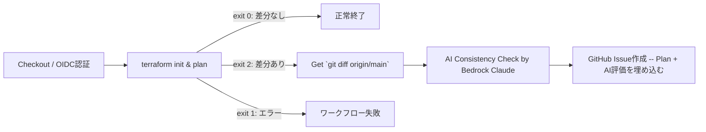

## はじめに

前回の記事「[TerraformのドリフトをGitHub Issueに自動作成するまで](https://zenn.dev/koya6565/articles/20260219_terraform-drift-detection-github-issue)」の続き。

> `gh diff`と`terraform plan`の結果を照合して「意図しない変更がplanに含まれるかどうか」を評価する

今回は`terraform plan`の出力と`git diff`の内容をAWS Bedrock上のClaude Sonnet 4.6に渡し、整合性チェックの結果をIssue本文に自動で埋め込む方法を試したら、それなりに実用性の高いものができた。


## 今回追加したステップの全体像

前回からの差分として、ワークフローに3つのステップを追加した。



追加ステップ：
1. **Get Git Diff** — `git diff origin/main`でコード差分を取得し、一時ファイルに保存
2. **AI Consistency Check** — Plan出力とDiff差分をClaudeに渡し、整合性を評価させる
3. **Create issue** — Bedrockの応答内容をIssue本文に埋め込む

planやdiffの取得、それらをユーザプロンプトに含めるのはそのままなので、「システムプロンプトによる指示」「issueを自動作成する際の本文フォーマット」が考え所になった。

## プロンプト設計（抜粋）

システムプロンプトは「Terraformインフラ変更レビューア」として役割を与え、評価基準と出力フォーマットを明示している。
（以下、一例）

```markdown
# 評価基準：
1. **Planにあり、Diffにない変更** → ドリフトの可能性あり（コード変更なしに実態が変わっている）
2. **Diffにあり、Planにない変更** → 変更影響のないコード差分（リファクタリング等）
3. **PlanとDiffで一致している変更** → 意図通りの変更

# 出力フォーマット（GitHub Markdownで回答してください）
整合性判定: [一致 / 部分一致 / 不一致]
[!NOTE] (ex. 一致)
[!WARNING] (ex. 部分一致)
[!CAUTION] (ex. 不一致) 
（calloutブロックにて、1-2文で全体的な評価を記載する）

## 詳細
- .....

## 補足、注意点
- .....
```

## Bedrock API呼び出し（抜粋）

```yaml
- name: AI Consistency Check (Bedrock Claude)
  id: ai-check
  if: steps.plan.outputs.exitcode == '2'
  working-directory: ${{ env.TF_WORKING_DIR }}
  run: |
    PLAN_OUTPUT=$(terraform show tfplan.binary 2>/dev/null | head -c 30000)
    GIT_DIFF=$(head -c 30000 /tmp/git_diff.txt)

    SYSTEM_PROMPT='
    # 中略 #
    '

    jq -n \
      --arg system "$SYSTEM_PROMPT" \
      --arg plan "$PLAN_OUTPUT" \
      --arg diff "$GIT_DIFF" \
      '{
        anthropic_version: "bedrock-2023-05-31",
        max_tokens: ${{ env.BEDROCK_MAX_TOKEN }},
        temperature: ${{ env.BEDROCK_TEMPERATURE }},
        top_k: ${{ env.BEDROCK_TOP_K }},
        system: $system,
        messages: [{
          role: "user",
          content: ("## Terraform Plan出力\n<plan>\n" + $plan + "\n</plan>\n\n## Git Diff（コード差分）\n<diff>\n" + $diff + "\n</diff>")
        }]
      }' > body.json

    if aws bedrock-runtime invoke-model \
      --model-id ${{ env.BEDROCK_MODEL_ID }} \
      --body fileb://./body.json \
      --content-type application/json \
      --accept application/json \
      /tmp/bedrock_response.json; then
      AI_EVALUATION=$(jq -r '.content[0].text' /tmp/bedrock_response.json)
    else
      AI_EVALUATION="(Bedrock API 呼び出しに失敗しました。IAM権限またはモデルアクセス設定を確認してください。)"
    fi
```

### 実装上のポイント
- 生成AIに指示する場合、改行は大切なのでheredocを多用する
- （上記には載っていないが）`terraform plan`実行時に`-detailed-exitcode`をつけることで、必要な分岐に対応している
  - https://developer.hashicorp.com/terraform/cli/commands/plan#detailed-exitcode


## Issue本文にClaudeによる評価結果を埋め込む（抜粋）

```yaml
- name: Create issue when drift
  id: drift
  if: steps.plan.outputs.exitcode == '2'
  working-directory: ${{ env.TF_WORKING_DIR }}
  env:
    GH_TOKEN: ${{ github.token }}
    AI_EVALUATION: ${{ steps.ai-check.outputs.evaluation }}
  run: |
    PLAN_SHOW=$(terraform show tfplan.binary)

    cat <<EOF > issue_body.md
    ## Terraform Plan Summary

    **Environment:** \`${{ inputs.environment }}\`
    **Commit Hash:** ${{ github.server_url }}/${{ github.repository }}/commit/${{ github.sha }}
    **Triggered by:** @${{ github.actor }}
    **Workflow Run:** ${{ github.server_url }}/${{ github.repository }}/actions/runs/${{ github.run_id }}

    # 中略 #
    EOF

    gh issue create \
      --title "${TITLE}" \
      --body-file issue_body.md \
      --label "terraform-drift"
```

- issueタイトルにはtfstateのserial番号を付与して、重複したissueを自動作成しないようにした
  - 「同一タイトルだったら issue作成をスキップ」という簡易なもの
- 自動作成するissueのテンプレートを準備しておくことで、情報の品質を一定維持できる
  - おそらく、issue内容全てをClaudeに任せることも容易だが、減らせる不確定要素は無くした

## Tips: terraformプロバイダーのキャッシュ化

作業中、`terraform init`で毎回プロバイダーをダウンロードしていることに気づいたので、合わせて対処した。

### `TF_PLUGIN_CACHE_DIR`だけではキャッシュは効かない

`.terraform.lock.hcl`にプラットフォーム(ex.`linux_amd64`)のハッシュが含まれるので、lockファイルをgit管理していても、CI環境(ex.`ubuntu-latest`)と一致していなければ、キャッシュは効かない。

https://developer.hashicorp.com/terraform/language/files/dependency-lock
> To avoid this problem you can pre-populate checksums for a variety of different platforms in your lock file using the terraform providers lock command, which will then allow future calls to terraform init to verify that the packages available in your chosen mirror match the official packages from the provider's origin registry.

想定されるOS毎に`terraform providers lock`を実行すれば事前回避できるらしいが、今回はキャッシュ設定のステップ実行を追加対応した。

### 解決策：lock.hclもキャッシュに含める

`path:`にlock.hclも追加することで、初回CI実行後（`linux_amd64`ハッシュがlock.hclに追記された状態）のlock.hclもプロバイダーバイナリと一緒にキャッシュされる。
このキャッシュで`terraform init`のステップ実行は10sほど短縮できた。

```yaml
- name: Configure Terraform Plugin Cache
  run: |
    mkdir -p ~/.terraform.d/plugin-cache
    echo "TF_PLUGIN_CACHE_DIR=$HOME/.terraform.d/plugin-cache" >> $GITHUB_ENV

- name: Cache Terraform providers
  uses: actions/cache@v5
  with:
    path: |
      ${{ env.TF_PLUGIN_CACHE_DIR }}
      ${{ env.TF_WORKING_DIR }}/.terraform.lock.hcl
    key: terraform-${{ env.TF_VERSION }}-${{ runner.os }}-${{ hashFiles(format('{0}/.terraform.lock.hcl', env.TF_WORKING_DIR)) }}
    restore-keys: |
      terraform-${{ env.TF_VERSION }}-${{ runner.os }}-
```

## おわりに

今回のような用途では、人間の認知負荷を下げる方向で生成AIが役立つので、使い始めやすい。

ちなみに「terraformのplan結果を見やすくしたり、ドリフト検知したい」ためのOSSはすでにあり、自分が調べた感じでは2つほど。どちらも人気がありそう。

https://github.com/diggerhq/digger

https://github.com/suzuki-shunsuke/tfaction
