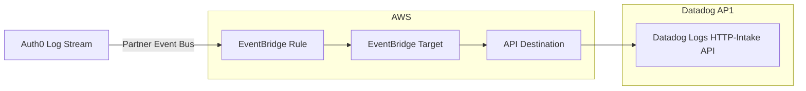

## 背景
https://support.auth0.com/center/s/article/Datadog-Log-Stream-Integration-for-Japan

Datadog AP1サイト(日本リージョン)を使っている場合、Auth0のLog StreamもDatadog AP1に設定できれば良いのですが、2026年3月時点では未対応で、先日、私はショックを受けてました。

上記URLの通り、Auth0公式のサポートセンターでも「US/EUリージョンのみ対応」との記載があり、ワークアラウンドも提示されていない状態です。

この記事では、そのワークアラウンドを考えたら何とかなったので、その構成と必要情報をまとめておきます。

### 想定読者
- Auth0ログをDatadog AP1サイトに送信したい人
  - おそらく、何らかの制約によって監視データも日本国内に保存したい場合
- AWS環境を使える
  - 今回、EventBridgeのAPI Destination方式を使ってます

## 構成フロー

ref.) EventBridge API destination
https://docs.aws.amazon.com/eventbridge/latest/userguide/eb-api-destinations.html


## Terraformスニペット

### モジュール呼び出し例
- EventBridgeのルールとターゲットを作成するTerraformモジュール
  - Auth0テナントごとにルールとターゲットを作成する
- `connection_arn`はAPI送信先（Datadog AP1）の接続情報を設定するため、シークレット情報を含むのでAWSコンソールから手動作成している
  - `DD-API-KEY`をカスタムヘッダとして、送信先のAPI Keyを指定する（`DD-API-KEY`は自動的にSecretsManager管理となる）
- API Destinationは環境に1つあれば良いので、最初のユースケースで作成し、以降は出力を使い回す

```hcl
module "auth0_logs_TenantA_to_datadog" {
  source = "../../modules/eventbridge_auth0_logs_to_datadog"

  rule_name                  = module.event_rule_name_auth0_logs_TenantA.name
  target_role_name           = module.target_role_name_datadog_ap1.name
  event_bus_name             = local.eventbridge.event_bus_name.auth0_TenantA
  connection_arn             = local.eventbridge.datadog.connection_arn_ap1
  invocation_endpoint        = local.eventbridge.datadog.invocation_endpoint_ap1
  api_destination_name       = module.destination_name_datadog_ap1.name
  api_destination_description = "Datadog AP1 log intake"
  maximum_retry_attempts     = local.eventbridge.datadog.maximum_retry_attempts
  tags                       = local.account_tags
}

module "auth0_logs_TenantB_to_datadog" {
  source = "../../modules/eventbridge_auth0_logs_to_datadog"

  rule_name            = module.event_rule_name_auth0_logs_TenantB.name
  target_role_arn      = module.auth0_logs_TenantA_to_datadog.invoke_role_arn
  api_destination_arn  = module.auth0_logs_TenantA_to_datadog.api_destination_arn
  event_bus_name       = local.eventbridge.event_bus_name.auth0_TenantB
  maximum_retry_attempts = local.eventbridge.datadog.maximum_retry_attempts
  tags                 = local.account_tags
}
```

### モジュール抜粋: API Destination
- `invocation_endpoint`: "https://http-intake.logs.ap1.datadoghq.com/api/v2/logs"

```hcl
resource "aws_cloudwatch_event_api_destination" "datadog" {
  count                            = local.use_existing_api_destination ? 0 : 1
  name                             = var.api_destination_name
  description                      = var.api_destination_description
  connection_arn                   = var.connection_arn
  invocation_endpoint              = var.invocation_endpoint
  http_method                      = var.http_method
  invocation_rate_limit_per_second = var.invocation_rate_limit_per_second
}
```
ref.) Datadog Logs HTTP Intake API
https://docs.datadoghq.com/ja/api/latest/logs/?site=ap1

## 設計上の考慮点
- API DestinationとIAMロールの共有
  - 環境毎（Datadog送信先毎）に1つあれば良いので、terraformでモジュール化しても重複して作成しないように共用する
- Auth0 Log Stream設定
  - テナント側では、EventBridgeに対するLog StreamのみあればOK
- Auth0テナント毎に作成されるEvent Bus
  - 長期ログ保存用とDatadog用、両方のルールを並行稼働させる（Busは1つでも複数ルールにイベントデータは流れる）
  - 長期ログ保存（ログ分析、監査）: EventBridge Rule -> DataFirehose -> S3
  - Datadog（モニタリング）: EventBridge Rule -> API Destination -> Datadog Logs
- Auth0ログ欠損リスク
  - リトライやDLQの設定をAWS側で行う
  - `invocation_rate_limit_per_second`: Datadog Logs APIのレート制限以内に収める必要あり..と思っていたら、ログ送信APIのレート制限は無いらしい（執筆時点）。驚きの仕様。

ref.) API レート制限ポリシーについて
https://docs.datadoghq.com/ja/api/latest/rate-limits/¥
> Datadog は、データポイント/メトリクスの送信に対してレート制限を設けていません (メトリクスの送信レートの処理方法については、メトリクスのセクションを参照してください)。制限に達したかどうかは、お客様の契約に基づくカスタムメトリクスの数量によって決まります。
> - ログを送信する API はレート制限されていません。
> - イベント送信のレート制限は、組織ごとに 1 時間あたり 500,000 イベントです。
> - エンドポイントのレート制限は様々で、以下に詳述するヘッダーに含まれています。これらはオンデマンドで拡張することができます。


## まとめ
Auth0が公式対応してくれるまでのワークアラウンド記録ですが、昨今の円安情勢を考えると、Datadog AP1サイト対応はされないかもしれないな...と感じています。
ただ、ワークアラウンド自体はAuth0 Knowledge Baseにあっても良い気がしているため、フィードバックだけしときました✔️
